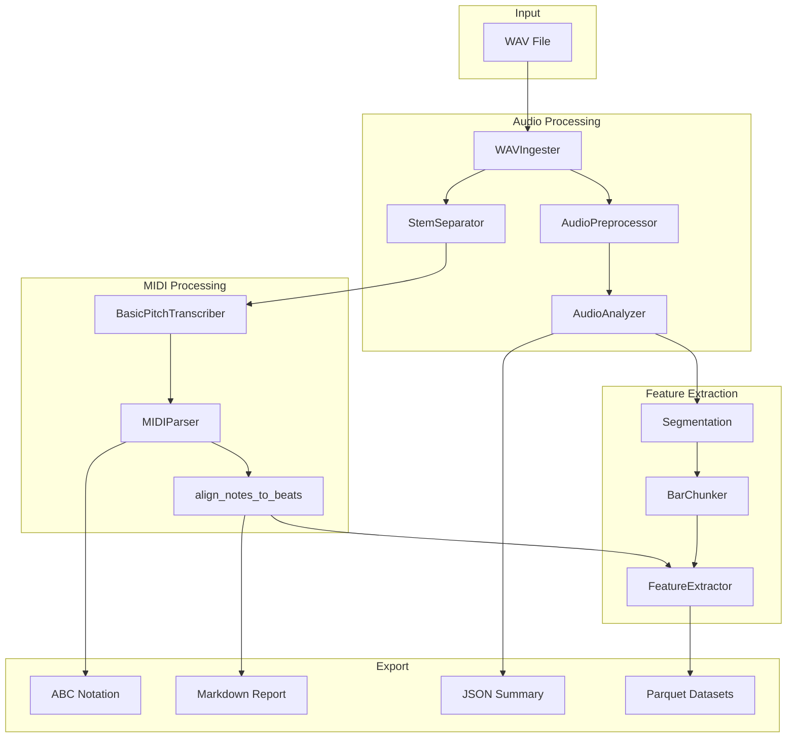
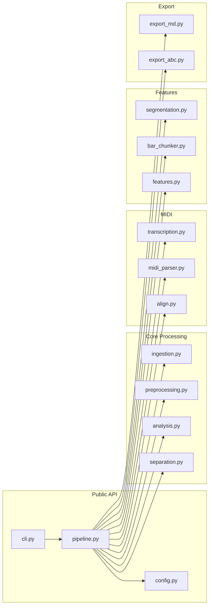

# Architecture Overview

This document describes the system architecture of didactic-engine.

---

## High-Level Architecture



---

## Component Diagram



---

## Data Flow

### Input Data Flow

```
WAV File (Path)
    │
    ▼
WAVIngester.load()
    │ Returns: (audio: np.ndarray, sample_rate: int)
    ▼
AudioPreprocessor.preprocess()
    │ Returns: (audio: np.ndarray, sample_rate: int)
    │ Side effect: Writes preprocessed.wav
    ▼
StemSeparator.separate()
    │ Returns: Dict[str, Path] (stem_name → wav_path)
    │ Side effect: Writes stems/*.wav
    ▼
Per-stem processing...
```

### Analysis Data Flow

```
audio: np.ndarray
    │
    ▼
AudioAnalyzer.analyze()
    │ Returns: Dict with:
    │   - tempo: float
    │   - beat_times: List[float]
    │   - librosa: Dict (spectral features)
    │   - essentia: Dict (optional)
    ▼
segment_beats_into_bars()
    │ Returns: List[Tuple[bar_idx, start_s, end_s]]
    ▼
Bar boundaries for chunking
```

### MIDI Data Flow

```
stem.wav (Path)
    │
    ▼
BasicPitchTranscriber.transcribe()
    │ Returns: midi_path: Path
    │ Side effect: Writes stem.mid
    ▼
MIDIParser.parse()
    │ Returns: Dict with:
    │   - notes_df: pd.DataFrame
    │   - tempo_map: List[Dict]
    ▼
align_notes_to_beats()
    │ Returns: pd.DataFrame with added columns:
    │   - beat_index, bar_index, beat_in_bar
    │   - start_beat_float, end_beat_float
    ▼
Aligned notes for export
```

---

## Key Classes

### PipelineConfig

```python
@dataclass(frozen=True)
class PipelineConfig:
    """Immutable configuration for the pipeline."""
    song_id: str
    input_wav: Path
    out_dir: Path
    # ... configuration fields
    
    # Properties compute output directories:
    @property
    def stems_dir(self) -> Path: ...
    @property
    def midi_dir(self) -> Path: ...
    # etc.
```

**Design decisions:**
- Frozen to ensure immutability during pipeline execution
- All paths derived from `out_dir` and `song_id`
- Sensible defaults for analysis parameters

### AudioPipeline

```python
class AudioPipeline:
    """Orchestrates the complete processing workflow."""
    
    def __init__(self, cfg: PipelineConfig):
        # Initialize all component classes
        self.ingester = WAVIngester(...)
        self.preprocessor = AudioPreprocessor()
        self.analyzer = AudioAnalyzer(...)
        # etc.
    
    def run(self) -> Dict[str, Any]:
        """Execute all 14 pipeline steps."""
        # Step 1: Copy input
        # Step 2: Ingest WAV
        # ...
        # Step 14: Write JSON summary
        return results
```

**Design decisions:**
- Single entry point via `run()`
- Components injected at initialization
- Results dict tracks all outputs

---

## External Dependencies

### Required

| Library | Purpose | Used In |
|---------|---------|---------|
| numpy | Array operations | All modules |
| pandas | DataFrames | features.py, midi_parser.py |
| librosa | Audio analysis | analysis.py, features.py |
| soundfile | WAV I/O | ingestion.py |
| pydub | Audio processing | preprocessing.py, bar_chunker.py |
| pretty_midi | MIDI parsing | midi_parser.py |
| music21 | ABC notation | export_abc.py |
| pyarrow | Parquet I/O | pipeline.py |

### Optional (External CLI)

| Tool | Purpose | Fallback |
|------|---------|----------|
| Demucs | Stem separation | Uses original audio as "full_mix" |
| Basic Pitch | Audio→MIDI | Skips MIDI transcription |

### Optional (Python)

| Library | Purpose | Fallback |
|---------|---------|----------|
| Essentia | Advanced audio features | Returns `{"available": False}` |

---

## Output Directory Structure

```
{out_dir}/
├── input/{song_id}/
│   └── original.wav          # Copy of input
├── preprocessed/{song_id}/
│   └── {song_id}.wav         # Normalized audio
├── stems/{song_id}/
│   ├── vocals.wav
│   ├── drums.wav
│   ├── bass.wav
│   └── other.wav
├── chunks/{song_id}/{stem}/
│   ├── bar_0000.wav
│   ├── bar_0001.wav
│   └── ...
├── midi/{song_id}/
│   ├── vocals.mid
│   └── ...
├── analysis/{song_id}/
│   └── combined.json         # Summary
├── reports/{song_id}/
│   ├── midi_markdown.md
│   ├── vocals.abc
│   └── ...
└── datasets/{song_id}/
    ├── events.parquet
    ├── beats.parquet
    ├── bars.parquet
    └── bar_features.parquet
```

---

## Error Handling Strategy

1. **Graceful degradation** for optional tools (Demucs, Basic Pitch, Essentia)
2. **Clear error messages** with installation instructions
3. **Validation early** (WAVIngester.validate())
4. **Continue on stem failure** (process other stems if one fails)

---

## Threading/Concurrency

The current implementation is **single-threaded**. Audio processing is CPU-bound
and handled sequentially. Future optimization could parallelize:
- Per-stem processing
- Bar-level feature extraction

---

## See Also

- [Key Flows](02_KEY_FLOWS.md) - Step-by-step pipeline walkthrough
- [Debugging](03_DEBUGGING.md) - Troubleshooting guide
