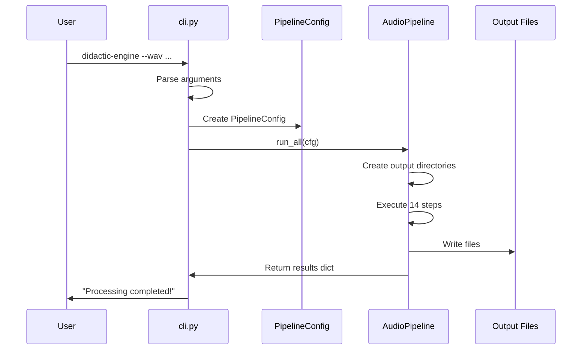
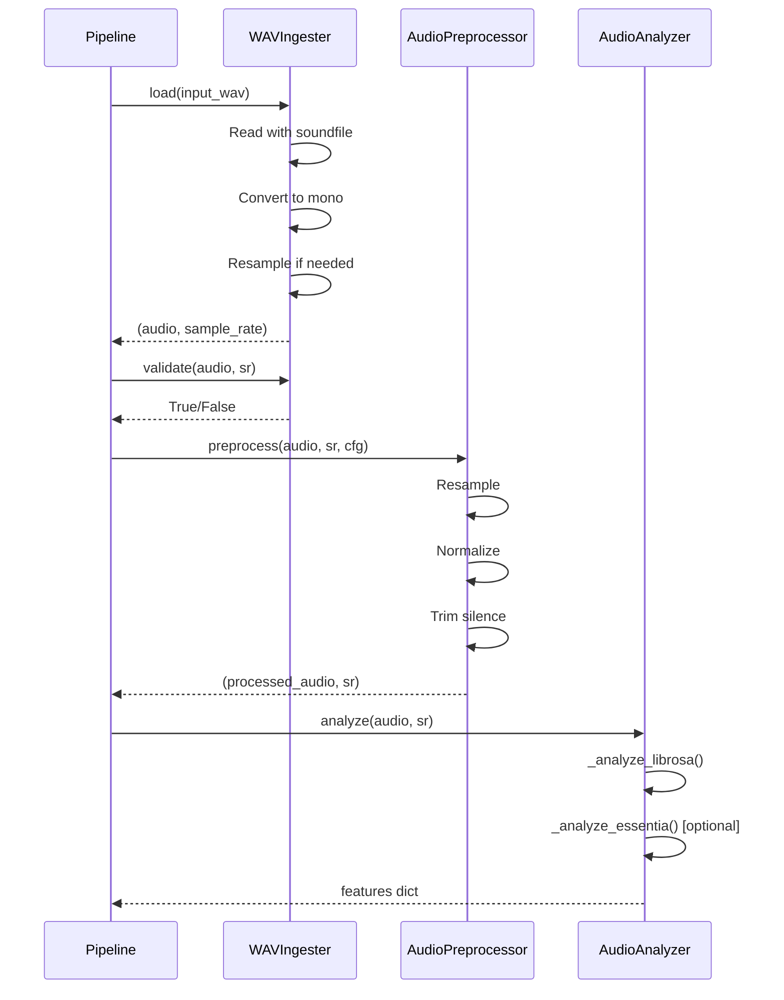
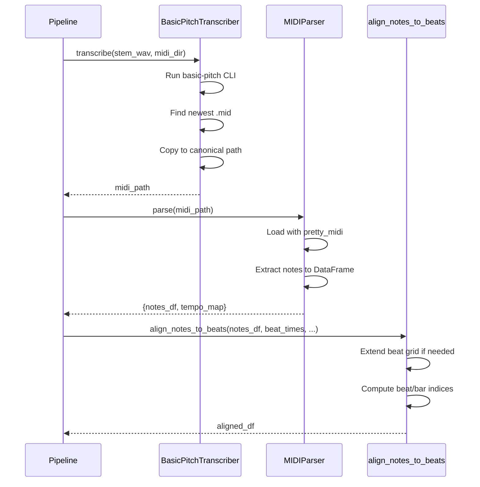
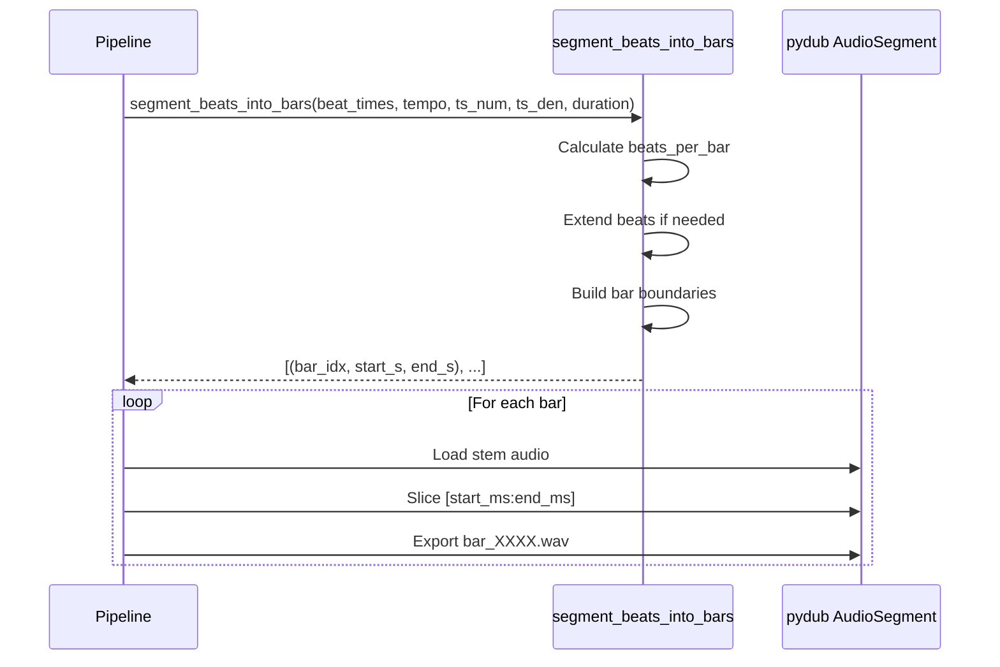

# Key Flows

This document traces the main execution flows through the didactic-engine codebase.

---

## Flow 1: CLI Invocation → Results

### Trigger
```bash
didactic-engine --wav song.wav --song-id my_song --out data/
```

### Sequence



### Code Path

```python
# cli.py
def main():
    parser = argparse.ArgumentParser(...)
    args = parser.parse_args()
    
    # Build config
    cfg = PipelineConfig(
        song_id=args.song_id,
        input_wav=args.wav,
        out_dir=args.out,
        ...
    )
    
    # Run pipeline
    run_all(cfg)

# pipeline.py
def run_all(cfg: PipelineConfig) -> Dict[str, Any]:
    pipeline = AudioPipeline(cfg)
    return pipeline.run()
```

---

## Flow 2: WAV → Analyzed Audio

### Purpose
Load a WAV file, validate it, optionally preprocess, and extract audio features.

### Sequence



### Key Data Transformations

```python
# Input
audio_path: Path = Path("song.wav")

# After ingestion
audio: np.ndarray  # Shape: (samples,), dtype: float32
sample_rate: int   # e.g., 22050

# After analysis
features: Dict[str, Any] = {
    "tempo": 120.0,
    "beat_times": [0.0, 0.5, 1.0, ...],
    "librosa": {
        "tempo_bpm": 120.0,
        "chroma_mean": [0.1, 0.2, ...],  # 12 values
        "mfcc_stats": [...],  # 13 coefficients
        "spectral_centroid": {...},
        ...
    }
}
```

---

## Flow 3: Audio → MIDI → Aligned Notes

### Purpose
Transcribe audio to MIDI, parse note events, and align to beat grid.

### Sequence



### Key Data Transformations

```python
# After MIDI parsing
notes_df: pd.DataFrame
#   pitch  velocity  start_s  end_s  dur_s  instrument_name ...
#   60     100       0.1      0.5    0.4    "Acoustic Grand Piano"

# After alignment
aligned_df: pd.DataFrame
#   ... original columns ...
#   beat_index  bar_index  beat_in_bar  start_beat_float  end_beat_float
#   0           0          0.2          0.2               1.0
```

---

## Flow 4: Beat Grid → Bar Chunks

### Purpose
Compute bar boundaries from beats and write per-bar audio chunks.

### Sequence



### Key Data Transformations

```python
# Input
beat_times: List[float] = [0.0, 0.5, 1.0, 1.5, 2.0, ...]
tempo_bpm: float = 120.0
ts_num: int = 4  # beats per bar
ts_den: int = 4  # quarter note = beat

# Output
bar_boundaries: List[Tuple[int, float, float]] = [
    (0, 0.0, 2.0),    # Bar 0: 0-2 seconds
    (1, 2.0, 4.0),    # Bar 1: 2-4 seconds
    ...
]

# Written files
# chunks/{song_id}/{stem}/bar_0000.wav
# chunks/{song_id}/{stem}/bar_0001.wav
# ...
```

---

## Flow 5: Results → Parquet Datasets

### Purpose
Build structured datasets from pipeline results and write to Parquet.

### Datasets Generated

| Dataset | Contents | Key Columns |
|---------|----------|-------------|
| events.parquet | Individual note events | song_id, stem, bar_index, pitch, velocity, start_s |
| beats.parquet | Beat grid | song_id, stem, beat_index, time_s, tempo_bpm |
| bars.parquet | Bar aggregates | song_id, stem, bar_index, num_notes, mean_velocity |
| bar_features.parquet | Audio features per bar | song_id, stem, bar_index, chroma, mfcc, spectral... |

### Code Path

```python
# pipeline.py

# Events: aligned notes
events_df = self.feature_extractor.extract_events(all_notes)
events_df.to_parquet(cfg.datasets_dir / "events.parquet")

# Beats: beat grid per stem
beats_df = self.feature_extractor.extract_beats(beat_times, tempo, stem, song_id)
beats_df.to_parquet(cfg.datasets_dir / "beats.parquet")

# Bars: aggregated note stats
bars_df = self.feature_extractor.extract_bars(all_notes, song_id)
bars_df.to_parquet(cfg.datasets_dir / "bars.parquet")

# Bar features: audio features per chunk
bar_features_df = pd.DataFrame(all_bar_features)
bar_features_df.to_parquet(cfg.datasets_dir / "bar_features.parquet")
```

---

## Flow 6: Results → Reports

### Purpose
Generate human-readable reports from pipeline results.

### Markdown Report

```python
# export_md.py
def export_midi_markdown(aligned_notes: Dict, output_path: str, song_id: str):
    """
    Write:
    # MIDI Analysis Report: {song_id}
    
    ## Bar 0
    | Pitch | Name | Velocity | Start | Duration |
    |-------|------|----------|-------|----------|
    | 60    | C4   | 100      | 0.10  | 0.40     |
    
    ## Bar 1
    ...
    """
```

### ABC Notation

```python
# export_abc.py
def export_abc(midi_path: str, output_path: str):
    """Use music21 to convert MIDI to ABC notation."""
    import music21
    score = music21.converter.parse(midi_path)
    score.write("abc", fp=output_path)
```

---

## Complete Pipeline Steps

| Step | Action | Module | Output |
|------|--------|--------|--------|
| 1 | Copy input file | shutil | input/{song_id}/*.wav |
| 2 | Ingest WAV | ingestion.py | audio array |
| 3 | Preprocess | preprocessing.py | preprocessed/{song_id}/*.wav |
| 4 | Analyze audio | analysis.py | features dict |
| 5 | Separate stems | separation.py | stems/{song_id}/*.wav |
| 6 | Compute bars | segmentation.py | bar boundaries |
| 7 | Write chunks | pipeline.py | chunks/{song_id}/*/*.wav |
| 8 | Transcribe MIDI | transcription.py | midi/{song_id}/*.mid |
| 9 | Parse MIDI | midi_parser.py | notes DataFrame |
| 10 | Align notes | align.py | aligned DataFrame |
| 11 | Build datasets | features.py | DataFrames |
| 12 | Write Parquet | pandas | datasets/{song_id}/*.parquet |
| 13 | Export reports | export_*.py | reports/{song_id}/* |
| 14 | Write summary | json | analysis/{song_id}/combined.json |

---

## See Also

- [Architecture](01_ARCHITECTURE.md) - System design overview
- [Debugging](03_DEBUGGING.md) - What to check when things fail
