# Dependency Maps & Coupling Report

This report is generated from the repository knowledge graph.

Artifacts used:
- `docs/knowledge_graph/output/knowledge_graph.json`

Regenerate:
- `python tools/knowledge_graph/build_knowledge_graph.py`
- `python tools/knowledge_graph/render_dependency_maps.py`

## didactic_engine module dependency graph

```mermaid
graph TD
%% didactic_engine IMPORTS graph
    M1[didactic_engine]
    M2[didactic_engine.align]
    M3[didactic_engine.analysis]
    M4[didactic_engine.bar_chunker]
    M5[didactic_engine.cli]
    M6[didactic_engine.config]
    M7[didactic_engine.essentia_features]
    M8[didactic_engine.export_abc]
    M9[didactic_engine.export_md]
    M10[didactic_engine.features]
    M11[didactic_engine.ingestion]
    M12[didactic_engine.midi_parser]
    M13[didactic_engine.onnx_inference]
    M14[didactic_engine.pipeline]
    M15[didactic_engine.preprocessing]
    M16[didactic_engine.segmentation]
    M17[didactic_engine.separation]
    M18[didactic_engine.transcription]
    M19[didactic_engine.utils_flatten]
    M1 --> M6
    M1 --> M8
    M1 --> M9
    M1 --> M14
    M4 --> M7
    M4 --> M10
    M4 --> M16
    M5 --> M6
    M5 --> M14
    M14 --> M2
    M14 --> M3
    M14 --> M6
    M14 --> M8
    M14 --> M9
    M14 --> M10
    M14 --> M11
    M14 --> M12
    M14 --> M15
    M14 --> M16
    M14 --> M17
    M14 --> M18
    M15 --> M6
```

## didactic_engine coupling hotspots

| Module | Imports (out) | Imported-by (in) | Total coupling |
|---|---:|---:|---:|
| `didactic_engine.pipeline` | 12 | 2 | 14 |
| `didactic_engine.config` | 0 | 4 | 4 |
| `didactic_engine` | 4 | 0 | 4 |
| `didactic_engine.bar_chunker` | 3 | 0 | 3 |
| `didactic_engine.segmentation` | 0 | 2 | 2 |
| `didactic_engine.features` | 0 | 2 | 2 |
| `didactic_engine.export_md` | 0 | 2 | 2 |
| `didactic_engine.export_abc` | 0 | 2 | 2 |
| `didactic_engine.preprocessing` | 1 | 1 | 2 |
| `didactic_engine.cli` | 2 | 0 | 2 |
| `didactic_engine.transcription` | 0 | 1 | 1 |
| `didactic_engine.separation` | 0 | 1 | 1 |

### didactic_engine cycles

- No cycles detected.

## music_etl module dependency graph

```mermaid
graph TD
%% music_etl IMPORTS graph
    M1[music_etl]
    M2[music_etl.align]
    M3[music_etl.audio_preprocess]
    M4[music_etl.bar_chunker]
    M5[music_etl.config]
    M6[music_etl.datasets]
    M7[music_etl.essentia_features]
    M8[music_etl.export_abc]
    M9[music_etl.export_md]
    M10[music_etl.midi_features]
    M11[music_etl.pipeline]
    M12[music_etl.separate]
    M13[music_etl.transcribe]
    M14[music_etl.utils_flatten]
    M15[music_etl.wav_features]
    M1 --> M5
    M11 --> M2
    M11 --> M3
    M11 --> M4
    M11 --> M5
    M11 --> M6
    M11 --> M7
    M11 --> M8
    M11 --> M9
    M11 --> M10
    M11 --> M12
    M11 --> M13
    M11 --> M14
    M11 --> M15
```

## music_etl coupling hotspots

| Module | Imports (out) | Imported-by (in) | Total coupling |
|---|---:|---:|---:|
| `music_etl.pipeline` | 13 | 0 | 13 |
| `music_etl.config` | 0 | 2 | 2 |
| `music_etl.wav_features` | 0 | 1 | 1 |
| `music_etl.utils_flatten` | 0 | 1 | 1 |
| `music_etl.transcribe` | 0 | 1 | 1 |
| `music_etl.separate` | 0 | 1 | 1 |
| `music_etl.midi_features` | 0 | 1 | 1 |
| `music_etl.export_md` | 0 | 1 | 1 |
| `music_etl.export_abc` | 0 | 1 | 1 |
| `music_etl.essentia_features` | 0 | 1 | 1 |
| `music_etl.datasets` | 0 | 1 | 1 |
| `music_etl.bar_chunker` | 0 | 1 | 1 |

### music_etl cycles

- No cycles detected.

## External dependency fan-in (imported by internal modules)

| Package | Import references |
|---|---:|
| `pathlib` | 24 |
| `numpy` | 17 |
| `typing` | 16 |
| `pandas` | 9 |
| `pydub` | 9 |
| `librosa` | 5 |
| `soundfile` | 5 |
| `shutil` | 5 |
| `subprocess` | 4 |
| `essentia` | 3 |
| `os` | 3 |
| `logging` | 2 |
| `dataclasses` | 2 |
| `music21` | 2 |
| `pretty_midi` | 2 |

## Interpretation guide

- **High imports (out)**: a module depends on many others (broad dependency surface).
- **High imported-by (in)**: a module is a shared dependency (potential hotspot).
- **Cycles**: increased refactor risk; consider extracting interfaces or moving shared types.

